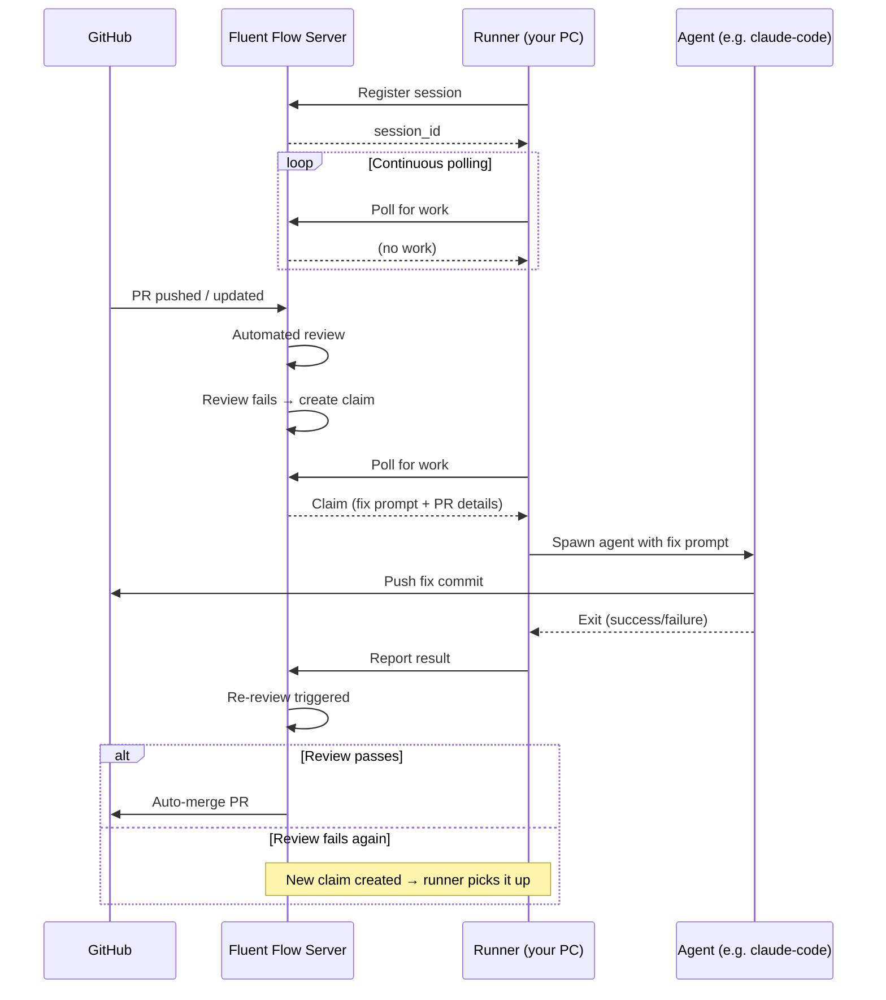

# fluent-flow-runner

CLI runner for [Fluent Flow](../fluent-flow/README.md). Connects to a Fluent Flow server, picks up fix claims (work assignments created when a code review fails), spawns the configured AI coding agent, and reports results.

## Prerequisites

All Admin API calls require `MCP_AUTH_TOKEN` — the shared secret configured on the Fluent Flow server. Find it in your server's environment (e.g. `docker-compose.yml` or `.env`), then export it locally:

```bash
export MCP_AUTH_TOKEN=<your-server-token>
```

## Quick Start

### 1. Register an Agent

Create an agent on the Fluent Flow server using the Admin API:

```bash
curl -X POST http://flow.fluenthive.io/api/agents \
  -H "Authorization: Bearer $MCP_AUTH_TOKEN" \
  -H "Content-Type: application/json" \
  -d '{
    "id": "my-runner",
    "agent_type": "claude-code",
    "transport": "long_poll",
    "repos": ["owner/repo"]
  }'
```

**Fields:**

| Field | Required | Description |
|-------|----------|-------------|
| `id` | Yes | Unique agent identifier |
| `agent_type` | Yes | `claude-code`, `codex`, `devin`, `openclaw`, `aider`, or `custom` |
| `transport` | Yes | Must be `long_poll` for runner usage |
| `transport_meta` | No | Transport-specific config (see below) |
| `repos` | No | Repos this agent can work on (e.g. `["fluent-io/fluent-hive", "fluent-io/api"]`). Omit or `[]` for all repos |

**`transport_meta`** is a JSON object with transport-specific settings. For `long_poll`:

| Key | Description |
|-----|-------------|
| `command` | Custom command template. Use `{prompt}` as placeholder for the review feedback. Overrides the default command for the `agent_type` |

#### Examples

Minimal — uses the default `claude-code` command, all repos:

```bash
curl -X POST http://flow.fluenthive.io/api/agents \
  -H "Authorization: Bearer $MCP_AUTH_TOKEN" \
  -H "Content-Type: application/json" \
  -d '{
    "id": "my-runner",
    "agent_type": "claude-code",
    "transport": "long_poll"
  }'
```

Scoped to specific repos:

```bash
curl -X POST http://flow.fluenthive.io/api/agents \
  -H "Authorization: Bearer $MCP_AUTH_TOKEN" \
  -H "Content-Type: application/json" \
  -d '{
    "id": "hive-runner",
    "agent_type": "claude-code",
    "transport": "long_poll",
    "repos": ["fluent-io/fluent-hive"]
  }'
```

Custom command template (e.g. wrapping codex with extra flags):

```bash
curl -X POST http://flow.fluenthive.io/api/agents \
  -H "Authorization: Bearer $MCP_AUTH_TOKEN" \
  -H "Content-Type: application/json" \
  -d '{
    "id": "codex-runner",
    "agent_type": "custom",
    "transport": "long_poll",
    "transport_meta": {
      "command": "codex --approval full-auto -q \"{prompt}\""
    },
    "repos": ["fluent-io/api"]
  }'
```

Alternatively, use the `create_agent` MCP tool if connected via MCP. See [MCP tools docs](../fluent-flow/src/mcp/README.md).

### 2. Generate a Token

```bash
curl -X POST http://flow.fluenthive.io/api/agents/my-runner/tokens \
  -H "Authorization: Bearer $MCP_AUTH_TOKEN" \
  -H "Content-Type: application/json" \
  -d '{"label": "my-laptop"}'
```

Response includes a `token` field (`ff_...`). Save it — it is only shown once.

### 3. Install

```bash
npm install -g fluent-flow-runner
```

Or from the repo:

```bash
cd packages/fluent-flow-runner
npm install
npm link
```

### 4. Run

```bash
fluent-flow-runner \
  --token ff_<your-token> \
  --server http://flow.fluenthive.io \
  --verbose
```

Or run directly without installing:

```bash
node packages/fluent-flow-runner/bin/fluent-flow-runner.js \
  --token ff_<your-token> \
  --server http://flow.fluenthive.io \
  --verbose
```

## CLI Flags

| Flag | Required | Description |
|------|----------|-------------|
| `--token` | Yes | Agent token from step 2 |
| `--server` | Yes | Fluent Flow server URL |
| `--command` | No | Override the default agent command template |
| `--cwd` | No | Working directory for spawned agent processes |
| `--verbose` | No | Enable debug-level JSON logging to stdout |

## How It Works

Once started, the runner is fully automatic — no user interaction needed. It runs a continuous loop until you stop it with `Ctrl+C`.



1. **Register** — Connects to the server and registers an ephemeral session (5min TTL)
2. **Poll** — Continuously checks the server for pending fix claims (~1s interval, extends session TTL on each poll)
3. **Execute** — When a review fails and work is assigned, automatically spawns the agent (e.g. `claude-code`) with the fix prompt
4. **Report** — After the agent finishes, reports the result (completed or failed) back to the server
5. **Repeat** — Returns to polling for the next claim

On shutdown (`Ctrl+C`), the runner reports any active claim as failed before exiting.

Built-in agent types (`claude-code`, `codex`, `aider`) spawn with `shell: false` — the prompt is passed as a discrete argument with no injection risk. Custom commands (`--command`) use `shell: true` with shell-character escaping.

## Token Management

You can create multiple tokens per agent — e.g. one per machine or team member. Use **list** to audit active tokens, and **revoke** to rotate credentials or decommission a machine.

```bash
# List tokens (shows labels and expiry, not the token values)
curl http://flow.fluenthive.io/api/agents/my-runner/tokens \
  -H "Authorization: Bearer $MCP_AUTH_TOKEN"

# Revoke a token (the runner using it will stop authenticating)
curl -X DELETE http://flow.fluenthive.io/api/agents/my-runner/tokens/1 \
  -H "Authorization: Bearer $MCP_AUTH_TOKEN"
```

## Agent Management

Use these to check which agents are registered, verify a runner is connected, or clean up agents you no longer need.

```bash
# List all agents — see what's registered
curl http://flow.fluenthive.io/api/agents \
  -H "Authorization: Bearer $MCP_AUTH_TOKEN"

# Get agent details — check transport, repos, and config
curl http://flow.fluenthive.io/api/agents/my-runner \
  -H "Authorization: Bearer $MCP_AUTH_TOKEN"

# View active sessions — verify a runner is connected and online
curl http://flow.fluenthive.io/api/agents/my-runner/sessions \
  -H "Authorization: Bearer $MCP_AUTH_TOKEN"

# Delete an agent — removes the agent and cascades to all its tokens and sessions
curl -X DELETE http://flow.fluenthive.io/api/agents/my-runner \
  -H "Authorization: Bearer $MCP_AUTH_TOKEN"
```
